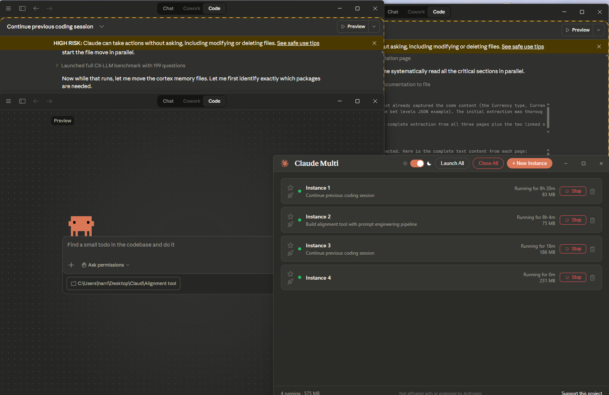

# Claude Multi

Run multiple Claude Desktop instances at the same time.

<!-- Replace with your own screenshot: -->

## What it does

Claude Desktop only allows one window at a time. Claude Multi removes that restriction so you can run as many independent instances as you want — each with its own conversations, Claude Code sessions, and MCP servers.

## Features

- Launch and manage multiple Claude Desktop instances from one place
- Each instance gets its own isolated profile (cookies, sessions, storage)
- Shared authentication — log in once, all instances stay signed in
- Live status cards showing memory usage, uptime, and active conversation title
- Favourite and auto-launch instances on startup
- Session conflict detection (warns you if two instances try to open the same CCD session)
- System tray with quick access to all instances
- Light and dark theme
- Portable — single exe, no installation

## Download

Grab `Claude.Multi.exe` from the [latest release](https://github.com/harry100-alt/Claude-Multi/releases/latest). It's a portable exe — just run it.

## Requirements

- Windows 10/11
- Claude Desktop installed (MSIX/Store version)

## Usage

1. **Quit Claude Desktop completely** — right-click the tray icon and click Quit. Claude Multi manages its own instances and will conflict with the default process if it's still running.
2. Run `Claude.Multi.exe`
3. Click **+ New Instance** to create an instance
4. Click **Launch** to start it

Each instance runs as a full, independent Claude Desktop window.

## How it works

Claude Multi creates a lightweight mirror of your Claude Desktop installation with a patched `app.asar` that removes the single-instance lock. Each instance uses a separate `--user-data-dir` so sessions, cookies, and local storage are isolated. Authentication is copied from your primary Claude profile so you don't need to log in again.

No files in your original Claude Desktop installation are modified.

## Known limitations

- Windows only (Mac/Linux not currently supported)
- Requires Claude Desktop to be fully closed before launching instances
- If Claude Desktop updates, the mirror will rebuild automatically on next launch

## License

MIT

## Author

Harry — [@harry100-alt](https://github.com/harry100-alt)

## Support

If you find this useful, consider [buying me a coffee](https://ko-fi.com/harry73).
